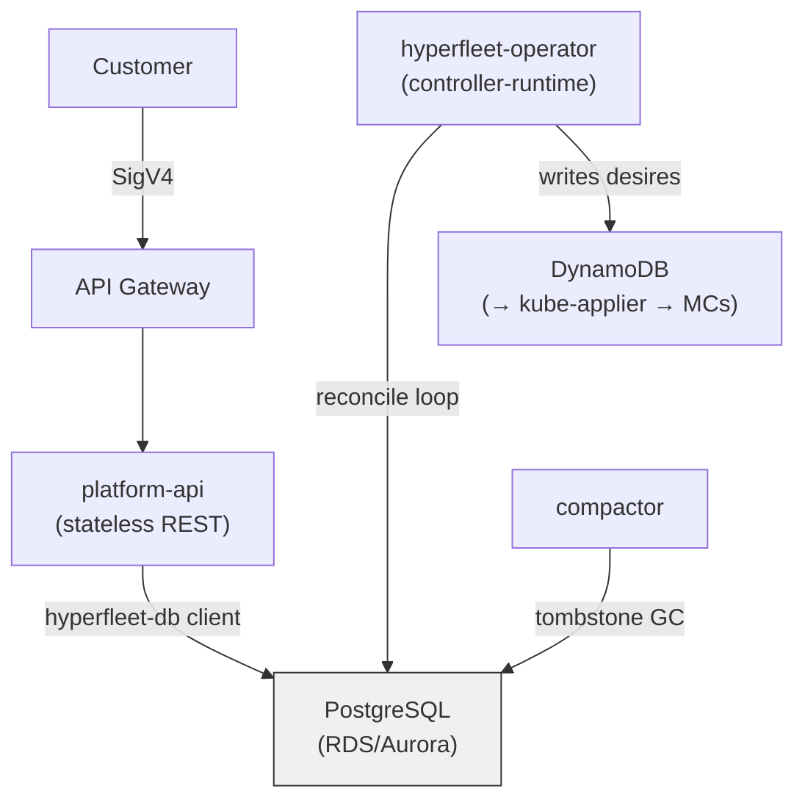

# Regional Control Plane Architecture

**Last Updated Date**: 2026-07-31

## Summary

The regional control plane manages ROSA HCP cluster lifecycles using Kubernetes-style reconciliation loops (controller-runtime) backed by PostgreSQL instead of etcd. This gives the team the reconciliation model it has deep expertise in while gaining the PITR, scalability, and queryability of a real database. The implementation consists of `hyperfleet-operator` (the controllers) and `hyperfleet-db` (a PostgreSQL-backed controller-runtime library).

## Context

- **Problem Statement**: The platform needs cluster lifecycle management that scales beyond etcd's ~8 GB hard ceiling and supports querying fleet state (e.g. "all clusters in degraded state"). The previous architecture (CLM) depended on another team's framework for lifecycle primitives, which constrained development velocity.
- **Constraints**:
  - Team must own the full lifecycle stack to move at its own pace
  - Must integrate with the existing Regional Cluster (EKS) and Management Cluster topology
  - Must support the platform-api as a stateless REST frontend
- **Assumptions**:
  - PostgreSQL (via RDS/Aurora) is available in all target AWS regions
  - controller-runtime's interfaces (`Manager`, `Client`, `Cache`) are stable and sufficient for the reconciliation model

## Design

### Components

**hyperfleet-operator** is a controller-runtime operator running on the Regional Cluster. It reconciles custom resources that model the cluster lifecycle.

The operator communicates with Management Clusters via DynamoDB desire documents. A desire is a declarative spec for a Kubernetes resource that should exist on an MC. The operator writes desires to DynamoDB; **kube-applier**, running on each MC, watches for desires and applies them to the local Kubernetes API server. Status flows back the same way — kube-applier writes observed state to DynamoDB status tables, and the operator reads it to update its own resource status.

**hyperfleet-db** is a Go library that implements controller-runtime's `Manager`, `Client`, and `Cache` interfaces against PostgreSQL. It stores all Kubernetes resources in a single `kubernetes_resources` table. The operator and platform-api both use it:

- **Operator**: uses the full `Manager` (client + cache + watch) for reconciliation
- **platform-api**: uses `Client` directly (no cache needed for stateless request/response)

This means the operator's CRDs are not stored in etcd — PostgreSQL is the sole state store.

**compactor** is a separate process that periodically deletes soft-deleted tombstones from PostgreSQL. It runs alongside the operator and advances a compaction horizon to prevent watchers from seeing gaps in the event stream.

### Why PostgreSQL

- **Scales beyond etcd**: No 8 GB ceiling.
- **Point-in-time recovery**: RDS/Aurora PITR provides disaster recovery without custom backup tooling.
- **Fleet querying**: SQL queries over cluster state (e.g. degraded clusters, clusters by region, placement utilization) without building a separate reporting layer.
- **Multi-AZ**: RDS synchronous standby provides zero acknowledged-write loss on failover.

For detailed internals (schema, invariants, watch mechanism, race catalog), see [hyperfleet-db DESIGN.md](../../../rosa-hyperfleet-api/hyperfleet-db/docs/DESIGN.md).

## Alternatives Considered

1. **CLM (Cluster Lifecycle Manager)**: A REST-based lifecycle service with adapters, sentinels, and CloudEvents. The CLM pattern used a stateless API server with GORM, a polling sentinel for change detection, CloudEvents for notification, and adapters for reconciliation. This was rejected because:
   - **Velocity**: The framework was owned by another team, creating a dependency that constrained the platform team's development pace.
   - **Component count**: 5+ components in the reconcile loop (API server, sentinel, message broker, adapters, status reporters) vs. 2 (operator + PostgreSQL).
   - **Operational overhead**: More services to deploy, monitor, and debug during incidents.

   For a detailed comparison of reliability and performance characteristics, see [Architecture Comparison](../../../rosa-hyperfleet-api/hyperfleet-db/docs/ARCHITECTURE_COMPARISON.md).

2. **Standard controller-runtime with etcd**: Using controller-runtime with its default etcd backend. This was rejected because:
   - **8 GB hard ceiling**: etcd's storage limit would require sharding to scale beyond a few thousand clusters, adding significant operational complexity.
   - **No fleet querying**: etcd supports key-prefix listing but not the rich queries needed for fleet management.
   - **No PITR**: etcd snapshots are coarse-grained; RDS PITR provides second-granularity recovery.

## Design Rationale

- **Justification**: The team has deep expertise in Kubernetes-style reconciliation (watch, reconcile, requeue). By implementing controller-runtime's storage interfaces against PostgreSQL, the operator retains that programming model while gaining a real database's PITR, scalability beyond etcd's 8 GB ceiling, and SQL queryability over fleet state. The team owns the full stack.
- **Evidence**: Measured write latency of p50=6.3ms / p99=29ms and throughput of 6,132 writes/s with realistic 15-20KB payloads (Aurora I/O Optimized, db.r6g.8xlarge). See [Architecture Comparison](../../../rosa-hyperfleet-api/hyperfleet-db/docs/ARCHITECTURE_COMPARISON.md) for full benchmarks.
- **Comparison**: CLM's advantages (standard REST API, operational familiarity, existing ecosystem) are real but secondary to the team velocity and component reduction goals that motivated the change.

## Consequences

### Positive

- Team owns the full cluster lifecycle stack with no external framework dependencies
- Fewer components to deploy, monitor, and debug (2 vs. 5+)
- Point-in-time recovery via RDS without custom backup infrastructure
- SQL-based fleet querying without a separate reporting layer

### Negative

- No direct `kubectl` access to cluster state — state lives in PostgreSQL, not the Kubernetes API server
- hyperfleet-db is a custom library that must be maintained alongside upstream controller-runtime changes

## Cross-Cutting Concerns

### Reliability

- **Resiliency**: RDS Multi-AZ synchronous standby provides zero acknowledged-write loss on failover. A continuous production verifier checks correctness invariants on live data. See [hyperfleet-db DESIGN.md](../../../rosa-hyperfleet-api/hyperfleet-db/docs/DESIGN.md) for the invariant catalog.
- **Observability**: The operator exposes standard controller-runtime metrics. The compactor logs tombstone deletion counts and compaction horizon advances.

### Performance

- This is a low write-rate system — cluster lifecycle events (create, update, delete) and underlying status updates are infrequent relative to the throughput ceiling
- Write latency: p50=6.3ms, p99=29ms with realistic 15-20KB payloads (Aurora I/O Optimized, db.r6g.8xlarge)
- Throughput ceiling: 6,132 writes/s with realistic payloads — orders of magnitude above expected load
- No-op suppression: content-equal writes consume no sequence, version bump, or watch event

### Cost

- RDS/Aurora instance per region (sized by cluster count — db.r6g.large at 5,000 clusters, db.r6g.2xlarge at 50,000)
- Eliminates CLM API server, sentinel, and adapter compute costs
